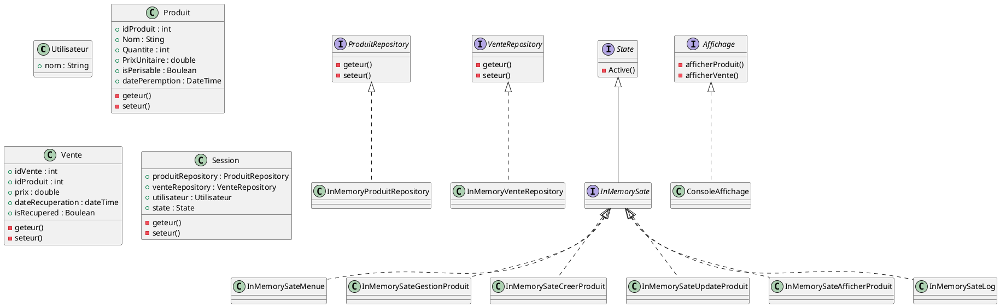

# Projet : Gestion des stocks pour un magasin local

---

## Problématique
Le propriétaire d'un petit magasin rencontre des difficultés à gérer son inventaire :
- Il perd parfois des ventes parce qu’il ne sait pas quels articles sont en rupture de stock.
- Il a du mal à suivre les produits à rotation lente ou rapide.
- Il veut éviter les pertes causées par des produits expirés ou démodés.

---

## Envies du client
1. **Interface conviviale** : Une application simple où il peut facilement ajouter, modifier ou supprimer des produits.
2. **Notifications intelligentes** : Être averti lorsque le stock d'un produit est faible ou lorsqu'un produit approche de sa date d’expiration.
3. **Rapports** : Obtenir des résumés hebdomadaires et mensuels (ventes, produits restants, etc.).
4. **Base de données robuste** : Conserver toutes les informations sur les produits (nom, catégorie, quantité, prix, fournisseur, date d’expiration).
5. **Gestion des fichiers** : Pouvoir exporter les rapports sous forme de fichiers CSV ou PDF pour les partager avec des partenaires.
6. **Accessibilité** : Utiliser l’application depuis son ordinateur principal, mais aussi avoir une sauvegarde sécurisée des données pour éviter toute perte.

---

## Diagramme UML

